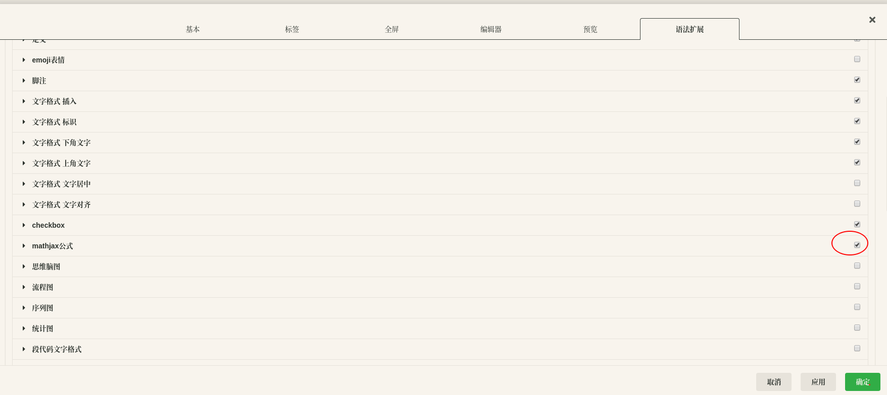

aaa

https://zoharyip.club/posts/gfm-note.html#mermaid

bbb


ccc


ddd


# trace
[lttng](http://lttng.org/)
# stess-ng

# timesync

图片


# 绘图


# 公式
公式是扩展语法，需要在设置里面打开mathjax选项，示例如下

`!$ \Gamma(z) = \int_0^\infty t^{z-1}e^{-t}dt\,. $`
```mathjax!
$$\Gamma(z) = \int_0^\infty t^{z-1}e^{-t}dt\,.$$
```

`!$ e^{20} $`

| A   | BB  | CCC | DDDD |     |
| --- | --- | --- | ---- | --- |
| 32  |     |     |      |     |
|     | 46  |     |      |     |
|     |     | d   |      |     |
|     |     |     |      |     |

=======


| left | center | rigit |
| :--- | :----: | ----: |
| 1    |   2    |     3 |
| 45   |   67   |    89 |


- [x] todo
- [x] todo
- [x] todo

$$
f(x) = \int_{-\infty}^{\infty}\hat f(\xi)\,e^{2\pi i \xi x} \, d\xi
$$


<html>
    <head>
        <meta charset="UTF-8">
        <title>123456</title>
    </head>
    <body>
    </body>
</html>


使用小书匠画的图，内容粘贴过来即可显示，但import文件才是正途，目前不会


<div>
  <div class="xsj_drawio_image"></div>
  <div class="xsj_drawio_xml" style="display:none;">&lt;mxfile userAgent="Mozilla/5.0 (X11; Linux x86_64) AppleWebKit/537.36 (KHTML, like Gecko) Chrome/80.0.3987.163 Safari/537.36" version="8.5.3" editor="www.draw.io"&gt;&lt;diagram&gt;zZTBboMwDIafhjuQauuOa9dth+3Uw85R45FMAaPUFNjTLzSmKaKdJk2TdkH4sx3bPw6JWJfdk5O1fkUFNslT1SXiIclzkab+OYA+gEW2DKBwRgWURbA1n8CQ84rGKNhPAgnRkqmncIdVBTuaMOkcttOwd7TTqrUsYAa2O2nn9M0o0oEu89vIn8EUeqyc3dwFTynHYJ5kr6XC9gyJTSLWDpHCW9mtwQ7ajbqEvMcr3lNjDir6ScIiJBykbXg27ov6cVhQfnY20ZHGAitpN5GuHDaVguHE1Fsx5gWx9jDz8AOIev6QsiH0SFNp2RtqDoWujsFoj43bcRS3StIVwFHiJKFfPcASyPU+xIGVZA7T0yUvQXGKizr5F5bqsmz5TLb7mW5RlWHEVhuCbS2Pzbf+VlxS4ACOoPteg/l0Y8J4O/hSZYLtNq5oNu6dPlvPm/T3goiZIKt/J0j+h4J4M17ao+/szyc2Xw==&lt;/diagram&gt;&lt;/mxfile&gt;</div>
</div>


<div id="page1">
    <script>
        $("#page1").load("/home/wjt/lalalala256.github.io/_postsattachments/1606230140938.drawio.html");
    </script>
</div>


<div id="page1">
    <iframe align="center" width="100%" height="170" src="./_posts/attachments/1606230140938.drawio.html"  frameborder="no" border="0" marginwidth="0" marginheight="0" scrolling="no"></iframe>
</div>


<div class="mermaid">
sequenceDiagram
    Alice-->>John: Hello John, how are you?
    John-->>Alice: Great!
</div>

